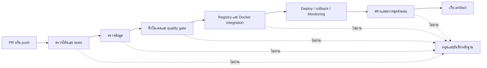

# CI/CD ในหน้าที่คนที่ 6

ใช้ GitHub Actions เรียก automated tests และ Docker Compose เชื่อมงานเดิมของทีม Airflow ยัง orchestrate ตาม DAG เดิม ส่วน CI เรียก stage runner เดียวกันบน environment แยก

## ลำดับงาน

1. อ่านโค้ดของ PR หรือ branch ที่ push และบันทึก commit จริง
2. สร้าง image จาก Python ที่ระบุ digest และ dependency lock ของโครงการ
3. ตรวจไวยากรณ์ Python, unit tests ของโครงการ และ tests ของ serving
4. ดาวน์โหลด/เตรียมข้อมูล เรียก validator และสร้าง features ของทีม
5. รัน Experiment 2 → Experiment 3 → verify full folds → quality gate ด้วยกฎเดิม
6. ลง Registry ของ CI → export joblib → ตรวจ parity, HTTP, benchmark, SLO → deploy → rollback/restore → ตรวจ Monitoring events
7. สร้างชุดส่งมอบ มี source, requirements, candidate/fallback, checksum และ provenance
8. build image จากชุดส่งมอบจริง และตรวจ HTTP/prediction parity ของทั้งสองโมเดล
9. เก็บหลักฐานทุกกรณี ส่งมอบ artifact เฉพาะรอบปกติที่ผ่านครบ

## ไฟล์และหน้าที่

| ไฟล์ | หน้าที่ |
|---|---|
| `.github/workflows/ml-ci.yml` | trigger และด่านที่แสดงบน GitHub Actions |
| `scripts/ci_pipeline.py` | เรียกงานทีมและหยุดเมื่อด่านก่อนหน้าไม่ผ่าน |
| `ci/Dockerfile` | environment สำหรับตรวจและฝึกโมเดล |
| `ci/compose.yaml` | runner, candidate API, production API และ volume แยก |
| `ci/runtime.Dockerfile` | image ชุดส่งมอบที่โหลดโมเดลจริง |
| `ci/delivery.compose.yaml` | รันชุดส่งมอบและเลือก fallback |
| `docs/ci_delivery_th.md` | คู่มือผู้รับชุดส่งมอบ |

## Trigger และ branch

- PR ไป Dec/main: รอบปกติ
- push เข้า Dec/main: รอบปกติหลังทีมอนุมัติ merge
- push เข้า ci/evidence/**: หลักฐานใน branch ทดสอบแยก
- workflow_dispatch: เลือกสถานการณ์เมื่อ GitHub เปิดให้ dispatch workflow นี้
- ไม่มีขั้นตอน merge, push กลับ main หรือ deploy บนเครื่องสมาชิก

ใช้สิทธิ์ contents: read ไม่ส่ง credentials ให้ container และไม่ใช้ pull_request_target ผู้ดูแล repository สามารถตั้ง required checks หลังเห็นผลรอบจริง

## พิสูจน์การหยุดเมื่อผิดพลาด

| สถานการณ์ | สิ่งที่เปลี่ยนเฉพาะรอบ | ด่านที่ต้องล้มเหลว |
|---|---|---|
| bad_code | ข้อความ Python ที่ผิดไวยากรณ์ | code |
| bad_data | ยอดขายแถวแรกติดลบใน workspace ชั่วคราว | data |
| bad_model | MAE ใน metadata ชั่วคราวสูงกว่า baseline | model |

ทั้งสามรอบต้องเป็นสีแดงจริง ด่าน deploy/ส่งมอบถูกข้าม ไม่ใช้ continue-on-error กลบความล้มเหลว ข้อมูล/โมเดลบนเครื่องและ branch หลักไม่ได้รับการเปลี่ยนจาก fixtures นี้

## เกณฑ์ที่คงจากทีม

- Model gate: config/model_registry.json และ registry.check_candidate
- Registry benchmark: batch 32, concurrency 4 ตาม policy
- API SLO: single record, 500 requests, concurrency 10 ตาม serving/slo.json
- เลือกโมเดลด้วย Experiment 2/3 เดิม ไม่ปรับเกณฑ์เพื่อให้ผลผ่าน
- ตัวอย่าง synthetic ของ serving ใช้ใน unit tests; integration/ชุดส่งมอบใช้โมเดลจากข้อมูลโครงการจริง

## การส่งมอบและหลักฐาน

CD เป็น continuous delivery: สร้างชุดผ่านการตรวจและทดสอบ deploy ใน Docker ของ CI พร้อม rollback ยังไม่มี server production ของทีมที่ระบุไว้สำหรับ deploy อัตโนมัติ

Artifacts เก็บ 14 วัน ควรดาวน์โหลดก่อนหมดอายุ รายงานใน repository เก็บ run URL, commit และผลแต่ละด่าน ไม่ commit ข้อมูลดิบหรือ model binary

เปิด [หน้า workflow บน GitHub](https://github.com/Frosty-jub/ml-project/actions/workflows/ml-ci.yml) เลือกรอบ → คลิก job เพื่อดูคำสั่งและผลภาษาไทยของแต่ละด่าน ส่วน Artifacts อยู่หน้าสรุปรอบ ป้ายแดงของ branch bad-code/bad-data/bad-model หมายถึงระบบตรวจพบ fixture ที่ตั้งใจทำให้ผิด ต้องอ่านชื่อ branch และด่านที่ล้มเหลวประกอบ

การตรวจ PR ใช้ merge commit ชั่วคราวที่ GitHub สร้างสำหรับทดสอบร่วมกับ base branch; provenance บันทึก SHA ที่ checkout จริง ส่วน acceptance index เก็บทั้ง head SHA และ tested checkout SHA จึงอาจเป็นคนละค่าได้ โดยยังไม่มีการ merge PR จริง

Unit tests ก่อนฝึกอาจข้ามการตรวจ artifact ของ Experiment 3 หนึ่งข้อ เพราะเริ่มจาก workspace ว่าง จากนั้นด่าน model จะฝึกจริง ตรวจ full folds และ quality gate และด่าน integration ตรวจ schema/metadata/parity ของ artifact ที่สร้างแล้ว

## การแก้ปัญหาข้าม Windows/Linux

รอบ CI พบว่า Experiment 1 reference เก็บ SHA-256 ของ config แบบ CRLF แต่ GitHub checkout เป็น LF จึงเพิ่มการเทียบที่ยอมรับเฉพาะความต่างของ newline โดย manifest ยังต้องตรง bytes ของไฟล์ปัจจุบัน ส่วนข้อมูลต้นฉบับและจำนวนแถวของ split ยังตรวจเหมือนเดิม วิธีนี้นำกลับมาจากโค้ดในประวัติ Git ของโครงการที่มีอยู่ใน commit `1357cb9d775201091e5c9ed97dc4e189b24ee7eb` และเพิ่ม tests ให้ปฏิเสธ config ที่เปลี่ยนเนื้อหาจริง ไม่มีการแก้ reference metric หรือเกณฑ์เลือกโมเดล

Codex ช่วยเพิ่ม workflow, ตัวเรียก CI, Docker packaging และเอกสาร สมาชิกต้องอ่านและอธิบายลำดับได้ โค้ดข้อมูล/เลือกโมเดล/เกณฑ์อนุมัติใช้ของทีมตาม source map เดิม

อ้างอิง: [GitHub Actions workflow syntax](https://docs.github.com/en/actions/reference/workflows-and-actions/workflow-syntax), [workflow events](https://docs.github.com/en/actions/reference/workflows-and-actions/events-that-trigger-workflows)
