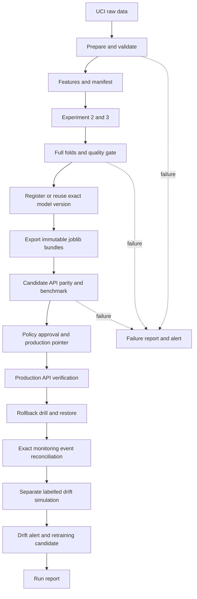

# Pipeline Orchestration ด้วย Apache Airflow

## เครื่องมือและขอบเขต

งานคนที่ 6 ใช้ Airflow ควบคุม DAG, Docker Compose เชื่อมบริการ, Python/unittest/HTTP checks ตรวจระบบ และ MLflow/FastAPI/Monitoring ของคนที่ 3–5 เป็นส่วนต่อประสาน เลือก Airflow เพราะเห็น task/dependency/logs/run history และ failure status ใน UI ชัดเจน และอยู่ในเครื่องมือที่เอกสารรายวิชาอนุญาต

ชุดนี้เป็น local demonstration บน Docker Desktop ไม่ต้องใช้ Prefect, ไม่ต้อง mount Docker socket และไม่ต้องติดตั้ง Python/Airflow บน Windows ชุดใหม่แยกจาก serving เดิมที่ port 18005 และ Registry เดิมบน host

## เริ่มจากเครื่องเปล่า

1. ติดตั้ง Git และ Docker Desktop เปิด Linux engine ให้พร้อม และมีอินเทอร์เน็ตสำหรับ image/packages/UCI dataset
2. Clone repository และ checkout branch ที่มีไฟล์ชุดนี้
3. เปิด PowerShell ที่ root ของ repository แล้วรัน:

```powershell
.\scripts\run_orchestration.ps1
```

หากนโยบาย PowerShell ของเครื่องปฏิเสธ script ให้ใช้เฉพาะ process นี้:

```powershell
powershell -ExecutionPolicy Bypass -File .\scripts\run_orchestration.ps1
```

สคริปต์เปิด stack และรอ Airflow จากนั้น trigger DAG และรอจบ พร้อมแสดงคำสั่ง/ผลลัพธ์และเก็บ transcript ถ้าต้องการแยกเปิดระบบกับ trigger:

```powershell
.\scripts\start_orchestration.ps1
.\scripts\verify_orchestration.ps1 -Scenario normal
```

ทุก normal run สร้าง workspace ใหม่ที่มีเฉพาะโค้ด/config แล้วดาวน์โหลดข้อมูล สร้าง features และเทรนเอง ไม่คัดลอก dataset/model จาก run เดิม Registry และ immutable bundles ใช้ร่วมกันเพื่อมีประวัติรุ่นและ rollback รุ่นที่ hash และ validation protocol เดียวกันสามารถ reuse ได้

Dockerfile ใช้ `orchestration/airflow/requirements.lock` ที่บันทึก dependencies ทั้งหมดของ project interpreter; ตัว Airflow ใช้ environment ของ image แยกต่างหาก Serving และ training ใช้ project interpreter ชุดเดียวกันใน stack ใหม่นี้ Environment จริงของแต่ละ run เก็บเป็น `environment.txt`

## เปิดหน้าเว็บ

| หน้า | URL |
|---|---|
| Airflow | http://127.0.0.1:18090 |
| Production API หลังผ่าน gate | http://127.0.0.1:18015/docs |
| Production health | http://127.0.0.1:18015/health |
| Candidate API | http://127.0.0.1:18016/docs |

API ตอบ health 503 ก่อนมี bundle ที่เลือกไว้ เป็นสถานะ not_ready ตามจริง และไม่ได้ทำให้ Airflow เริ่มไม่ได้ เมื่อ DAG สร้าง bundle และเขียน deployment pointer แล้ว health จึงเป็น 200

Airflow ใช้ SimpleAuthManager สำหรับ local development บัญชีเริ่มต้นของ standalone คือ admin รหัสถูกสร้างใน state volume ดูเฉพาะบนเครื่องด้วยคำสั่งต่อไปนี้และอย่านำผลลัพธ์ขึ้น Git:

```powershell
docker compose -f orchestration/airflow/compose.yaml exec -T airflow cat /opt/airflow-state/simple_auth_manager_passwords.json.generated
```

เลือก DAG `demand_forecasting_e2e` → Trigger → scenario `normal` จะสั่งทั้งกระบวนการด้วยปุ่มเดียว ค่าพารามิเตอร์ `bad_data` และ `bad_quality` ใช้ทดสอบ failure เท่านั้น

## แผนภาพและหน้าที่ของโค้ด



| ไฟล์ | หน้าที่ |
|---|---|
| `orchestration/airflow/dags/demand_forecasting_e2e.py` | นิยาม main DAG 16 tasks และ daily monitoring DAG |
| `orchestration/airflow/run_stage.py` | ทำงานแต่ละขั้นใน interpreter ของโปรเจกต์ เก็บผลและ lineage |
| `orchestration/airflow/trigger.py` | ส่ง JSON configuration เข้า Airflow CLI โดยไม่ติดปัญหา quoting ของ Windows |
| `orchestration/airflow/compose.yaml` | Airflow, candidate API, production API, init และ volumes |
| `serving/app/selector.py` | โหลด bundle ตาม pointer แบบตรวจ checksum/identity และสลับ runtime หลังตรวจผ่าน |
| `serving/app/main.py` | ใช้ selector เมื่อกำหนด MODEL_POINTER; request ที่กำลังทำงานยังถือ runtime/version ของตนเอง |
| `scripts/start_orchestration.ps1` | build และเปิด stack |
| `scripts/verify_orchestration.ps1` | trigger, รอผล, ตรวจ expected state และคัดลอกหลักฐานออกจาก Docker |
| `tests/test_orchestration.py` | ทดสอบ model switch/rollback/checksum, candidate mismatch และ event completeness |

## 16 tasks ใน main DAG

1. initialize: snapshot โค้ด/config, บันทึก hashes/environment และสถานะ production ก่อนรัน
2. prepare_data: download → prepare → validate → build features
3. experiment_2: เทรน/เปรียบเทียบตามงานโมเดลเดิม และเก็บ fallback ที่ผ่าน gate
4. experiment_3: เทรน final candidate ตามโค้ดและ configuration เดิม
5. verify_full_folds: ตรวจด้วยข้อมูลเต็มใน folds
6. candidate_quality_gate: ตรวจ 10 checks และ hash ของ candidate
7. register_models: บันทึกผล trial/code/data/environment, register หรือ reuse version ที่ตรง hash และ validation protocol
8. export_bundles: ตรวจ feature manifest, export joblib และเทียบ prediction กับ Registry
9. benchmark_candidates: ทดสอบ fallback และ candidate บน candidate API, Registry parity benchmark, HTTP checks, single-record load test และจับคู่ 520 events ของ measured/warmup requests ให้ครบ
10. approve_and_deploy: ตรวจ candidate hash ตรง gate, ใช้กฎ promotion ของ Registry, สลับ production pointer และตรวจ health/schema/prediction; กู้ pointer/aliases กลับหากการเปลี่ยนบริการล้มเหลว
11. rollback_drill: สลับกลับ previous ที่แตกต่างจริง ตรวจ prediction แล้วคืน candidate ที่อนุมัติ พร้อมตรวจอีกครั้ง
12. verify_monitoring: ส่ง probe ที่มี request ID ของ run ตรวจ event ครบ/ไม่ซ้ำ/feature/prediction/version ตรง และบันทึก mapping ไป SKU/origin date ของ validation replay
13. simulate_drift: สร้างข้อมูลจำลองของคนที่ 5 แยกเป็น synthetic_demo_only
14. check_drift: สร้าง reference, ตรวจ drift/performance และเก็บ alert/trigger
15. retrain_candidate: เรียก retraining หลัง trigger เท่านั้น เก็บ candidate_review และไม่ promote โมเดลจำลอง
16. write_run_report: ทำเสมอแม้ upstream fail เก็บ summary/failure alert และตั้งสถานะ failed ถ้ามีขั้นที่ไม่ผ่าน

## การอนุมัติและ SLO

ใช้กฎเดิมจาก `config/model_registry.json` เป็น model/serving promotion gate: MAE/folds, p50≤200 ms, p95≤500 ms, throughput≥100 predictions/s, batch 32, concurrency 4 และ benchmark ไม่เกิน 24 ชั่วโมง ต้องใช้ validation protocol เดียวกันและไม่แย่กว่า champion ตาม policy

ใช้ `serving/slo.json` เพิ่มเติมสำหรับ API workload แบบ 1 record/request: p50≤100 ms, p95≤250 ms, throughput≥20 requests/s, error≤1% ที่ 500 requests/concurrency 10 ทั้งสองชุดต้องผ่านก่อน deploy ใน local flow โดยไม่สับสน requests/s กับ predictions/s

การกดรัน normal อนุญาตให้ flow อนุมัติตามกฎเหล่านี้ใน stack สาธิตเท่านั้น นี่ไม่ใช่ลายเซ็นยืนยันแทนเจ้าของงาน สถานะ owner sign-off และ proposed SLO ในเอกสารทีมยังต้องยืนยันตามจริง และบันทึกไว้ใน approval.json ว่าเป็น automated local policy approval

## Monitoring กับข้อมูลจริง

DAG `demand_monitoring` กำหนด schedule รายวัน เมื่อเปิดใช้งานจะรอ input configuration ที่ `/project/artifacts/orchestration/monitoring_inputs.json` หากยังไม่มี inputs จะแสดง pending_inputs และไม่สร้าง label หรือ retrain เอง

ตัวอย่าง configuration (paths ต้องอยู่ภายใน `/project/artifacts/orchestration/`):

```json
{
  "events": "/project/artifacts/orchestration/monitoring/live_events.jsonl",
  "labels": "/project/artifacts/orchestration/monitoring/live_labels.csv",
  "reference": "/project/artifacts/orchestration/monitoring/reference.json",
  "current_model": "/project/artifacts/orchestration/bundles/<version-hash>/model.joblib",
  "params": "/project/artifacts/orchestration/monitoring/current_params.json"
}
```

events และ reference ต้องเป็นโมเดล/version/schema เดียวกัน; labels ใช้ request_id/row_index/actual/observed_at ตามคู่มือคนที่ 5 และต้องครบ horizon การส่ง historical validation replay เพื่อทดสอบ API ไม่ใช่การพยากรณ์สด จึงบันทึกแยกไว้และไม่อ้างว่าเป็น label ที่เพิ่งครบ 7 วัน ผล synthetic drift demonstration ไม่ใช่หลักฐานคุณภาพโมเดลจริง

เมื่อ input จริงพร้อม daily DAG เรียก monitoring check พร้อม health/metrics → บันทึก alert → retrain เฉพาะเมื่อ policy trigger และ labels พร้อม โมเดลใหม่เป็น candidate สำหรับ review/quality gate ไม่เปลี่ยน serving เอง ต้องตรวจ validation protocol ก่อนนำ candidate จาก retraining ไปใช้ promotion flow

## ทดสอบและเก็บหลักฐาน

```powershell
.\scripts\verify_orchestration.ps1 -Scenario normal
.\scripts\verify_orchestration.ps1 -Scenario bad_data
.\scripts\verify_orchestration.ps1 -Scenario bad_quality
.\scripts\verify_orchestration.ps1 -Scenario monitoring
```

ต้องมี normal run ที่ผ่านก่อน bad_data และ bad_quality ใช้สำเนาข้อมูลจาก normal run ที่ผ่านใน workspace แยกเพื่อทดสอบ failure boundary โดยไม่ต้องดาวน์โหลดและเทรนซ้ำ bad_data ใส่ยอดขายติดลบเพื่อพิสูจน์ว่า validator หยุดจริง bad_quality ใช้สำเนา candidate/metrics และเปลี่ยน MAE ให้แย่กว่า baseline ก่อน gate; tasks ฝึกของ scenario นี้ระบุชัดว่าเป็น test fixture ทั้งสองไม่แก้ production dataset/model/Registry ของ run ที่สำเร็จ script ต้องเห็น DAG failed, register_models ไม่ถูกเรียก, production pointer ไม่เปลี่ยน และมี failure_alert.json จึงถือว่าทดสอบผ่าน

ทดสอบ boundary ที่เกี่ยวข้องโดยตรง:

```powershell
docker compose -f orchestration/airflow/compose.yaml exec -T -w /project airflow /opt/project-venv/bin/python -m unittest tests.test_orchestration tests.test_registry tests.test_monitoring -v
```

หลักฐานใน `reports/orchestration/<run_id>/` ประกอบด้วย summary.json/md, ผลราย task, lineage hashes, environment.txt, quality_gate.json, registered.json, bundles.json, candidate/fallback benchmark, load_test.json, load_event_reconciliation.json, approval.json, rollback/restored parity และ drift_demo/retrained/candidate_review.json กรณีล้มเหลวมี alert_<stage>.json และ failure_alert.json

Airflow เก็บ task logs ใน state volume ใช้หน้า task → Logs หรือคัดลอกออกมาพร้อมหลักฐาน สคริปต์ PowerShell เก็บ transcript บน host และคัดลอก reports เมื่อ run จบ ไม่เก็บรหัสผ่าน, ข้อมูลดิบ, model binaries หรือ event features ทั้งชุดลง Git

## ความคงทนและการกู้คืน

Bundles เป็น immutable directory ใช้ SHA-256 ของ bundle file แยกจาก source artifact SHA-256 เพราะ serialization อาจได้ bytes ต่างกันทั้งที่ prediction เท่ากัน Registry/provenance/parity ถูกตรวจร่วมกัน Pointer เขียนผ่าน temporary file แล้ว rename และ selector ตรวจชื่อ/version/checksum/path ก่อนเปลี่ยน runtime

หาก process ถูก kill ระหว่างอัปเดต Registry กับ pointer อาจต้องกู้ deployment จาก `deployment_before.json` เพราะสองระบบไม่ใช่ transaction เดียว ห้ามอ้าง zero-downtime SLA จากเดโมนี้ การเริ่ม deploy รอบต่อไปตรวจความตรงกันของ Registry กับ pointer และหยุดหากไม่ตรง

หยุดระบบโดยเก็บ volumes:

```powershell
docker compose -f orchestration/airflow/compose.yaml stop
```

## ลำดับก่อน CI/CD และการใช้ AI

ตรวจ happy path, bad-data path, failed-gate path, rollback/restore, drift-to-candidate และการเริ่มจาก volume ว่าง จากนั้นเก็บโค้ดและหลักฐานที่ไม่เป็นข้อมูลลับใน commit/PR และ review กับสมาชิกตามหน้าที่ CI/CD สามารถเรียก automated checks ที่ยืนยันแล้ว โดยต้องตรวจคุณภาพโค้ด ข้อมูล และโมเดลตามรายวิชา

OpenAI Codex ช่วยออกแบบและเขียน Airflow DAG/stage runner, deployment selector, scripts, tests และเอกสารชุดนี้ สมาชิกต้องอ่านและอธิบายโค้ดที่ส่งได้ตามข้อกำหนดรายวิชา
