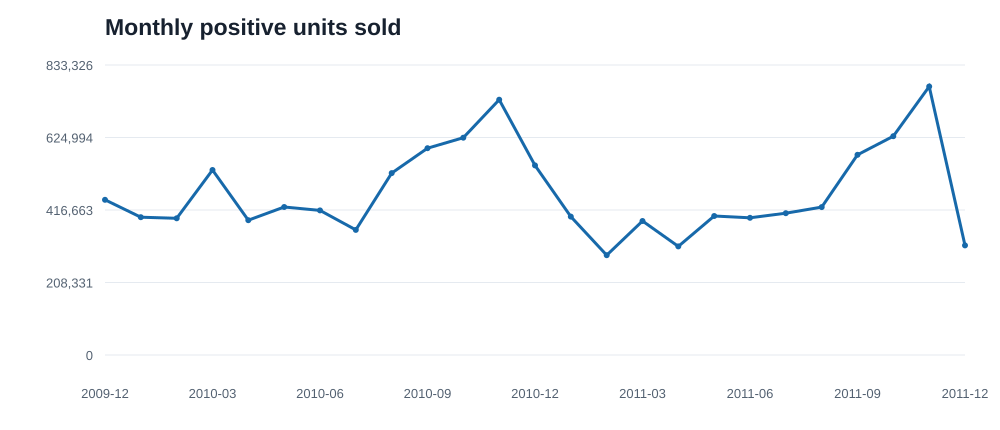
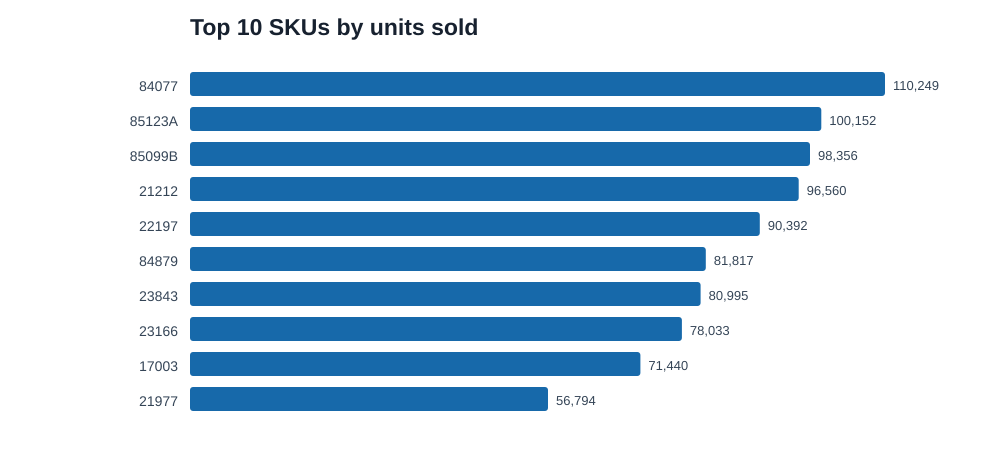
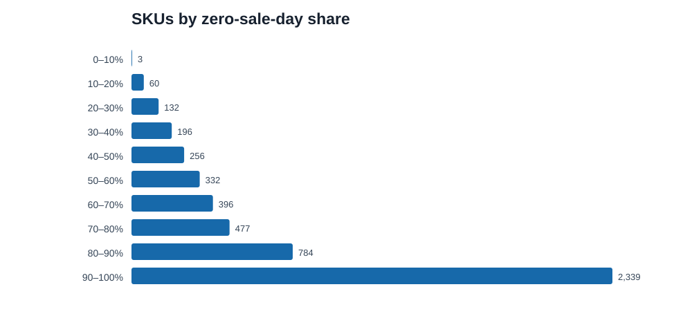

# รายงาน EDA ข้อมูล Online Retail II

รายงานนี้สร้างจากข้อมูลดิบและตาราง SKU รายวันที่เตรียมแล้วด้วย `python scripts/run_eda.py` จากโฟลเดอร์หลักของโครงงาน แหล่งข้อมูล: [UCI Online Retail II](https://archive.ics.uci.edu/dataset/502/online+retail+ii)

SHA-256 ของ ZIP ต้นทาง: `572e36277c2390fbfde10664750731e0a86f55e33470d91919085f0408e67bfb`

## ข้อมูลดิบ

ข้อมูลมี 1,067,371 แถวจากสอง sheet: `Year 2009-2010` 525,461 แถว, `Year 2010-2011` 541,910 แถว.

| สิ่งที่ตรวจ | จำนวนแถว |
| --- | --- |
| แถวซ้ำกันทุกคอลัมน์ (ยังไม่ลบ) | 34,335 |
| Invoice ยกเลิกที่ขึ้นต้น C | 19,494 |
| Quantity ≤ 0 หลังตัด invoice ยกเลิก | 3,457 |
| Price ≤ 0 (ยังไม่ตัดด้วยกฎนี้) | 6,207 |
| แถวขายบวกก่อนตัดรหัสที่ไม่ใช่สินค้า | 1,044,420 |
| แถวรหัสที่ไม่ใช่สินค้าที่ตัดออก | 3,425 |
| แถวขายบวกที่ใช้ในตารางรายวัน | 1,040,995 |
| จำนวนรหัส SKU ในไฟล์ดิบ | 5,304 |

### ค่าว่างในข้อมูลดิบ

| คอลัมน์ | แถวที่ว่าง | สัดส่วน |
| --- | --- | --- |
| Invoice | 0 | 0.0% |
| StockCode | 0 | 0.0% |
| Description | 4,382 | 0.4% |
| Quantity | 0 | 0.0% |
| InvoiceDate | 0 | 0.0% |
| Price | 0 | 0.0% |
| Customer ID | 243,007 | 22.8% |
| Country | 0 | 0.0% |

### รหัสที่อาจไม่ใช่สินค้าคงคลัง

ตารางนี้เป็นรายการรหัสที่ **ไม่มีตัวเลขในรหัส** จากข้อมูลดิบ รหัสตัวอักษรบางตัวอาจเป็นสินค้าจริง และรหัสค่าบริการบางตัวอาจมีตัวเลข

กฎที่ใช้งานจริงอยู่ใน `config/pipeline.json`: ตัด `ADJUST`, `AMAZONFEE`, `B`, `BANK CHARGES`, `D`, `DOT`, `POST`, `S` และยังคงแถวที่เหมือนกันทุกคอลัมน์ไว้ เหตุผลอยู่ใน `docs/data_pipeline_feature_engineering.md`

| StockCode | แถวขายบวก | หน่วยขายบวก | ตัวอย่างคำอธิบาย |
| --- | --- | --- | --- |
| POST | 1,893 | 10,411 | POSTAGE |
| DOT | 1,443 | 2,941 | DOTCOM POSTAGE |
| M | 883 | 10,057 | Manual |
| ADJUST | 36 | 36 | Adjustment by john on 26/01/2010 16 |
| BANK CHARGES | 35 | 35 |  Bank Charges |
| DCGSSGIRL | 24 | 192 | update |
| DCGSSBOY | 22 | 177 | update |
| PADS | 18 | 18 | PADS TO MATCH ALL CUSHIONS |
| B | 6 | 6 | Adjust bad debt |
| m | 5 | 5 | Manual |
| D | 5 | 196 | Discount |
| AMAZONFEE | 4 | 4 | AMAZON FEE |
| S | 3 | 3 | SAMPLES |

### จำนวนขายต่อบรรทัดและค่ามากผิดปกติ

| เปอร์เซ็นไทล์ | Quantity ต่อบรรทัด | Target รวม 7 วัน |
| --- | --- | --- |
| 50% | 3 | 0 |
| 90% | 24 | 56 |
| 99% | 108 | 392 |
| 99.9% | 500 | 1,330 |

จำนวนขายบวกต่อบรรทัดสูงสุด: 80,995 หน่วย รายการที่สูงมากควรตรวจว่าเป็นยอดขายส่งหรือข้อมูลผิด ไม่ควรลบด้วยเกณฑ์ตัวเลขโดยไม่มีเหตุผล

| Invoice | SKU | Description | Quantity | วันที่ |
| --- | --- | --- | --- | --- |
| 581483 | 23843 | PAPER CRAFT , LITTLE BIRDIE | 80,995 | 2011-12-09 |
| 541431 | 23166 | MEDIUM CERAMIC TOP STORAGE JAR | 74,215 | 2011-01-18 |
| 497946 | 37410 | BLACK AND WHITE PAISLEY FLOWER MUG | 19,152 | 2010-02-15 |
| 501534 | 21099 | SET/6 STRAWBERRY PAPER CUPS | 12,960 | 2010-03-17 |
| 501534 | 21091 | SET/6 WOODLAND PAPER PLATES | 12,960 | 2010-03-17 |

## แนวโน้มยอดขาย

กราฟนี้รวมจำนวนขายบวกจากข้อมูลดิบหลังกรอง invoice ยกเลิกและ Quantity ที่ไม่เป็นบวก โดยยังไม่ลบแถวซ้ำหรือรหัสค่าบริการ จึงใช้สำรวจข้อมูลก่อนกฎ clean สุดท้าย

## ตาราง SKU รายวันสำหรับพยากรณ์

| สิ่งที่ตรวจ | ผล |
| --- | --- |
| แถว SKU × วัน | 3,044,168 |
| SKU ที่มีวัน origin พร้อม label | 4,975 |
| ช่วงวัน origin | 2009-12-01 ถึง 2011-12-02 |
| คู่ SKU–วันซ้ำ | 0 |
| แถวที่ยอดขายรายวันเป็น 0 | 2,518,753 (82.7%) |
| แถวที่ target 7 วันเป็น 0 | 1,694,829 (55.7%) |
| จำนวนขายรายวันติดลบ | 0 |
| Target ติดลบ | 0 |
| เปอร์เซ็นไทล์กลางของสัดส่วนวันขาย 0 ต่อ SKU | 88.5% |
| SKU ที่มีวันขาย 0 ตั้งแต่ 90% ขึ้นไป | 2,345 |
| จำนวนวันต่อ SKU (ต่ำสุด / กลาง / สูงสุด) | 4 / 725 / 732 |

## การตัดสินใจที่ต้องทำก่อนฝึกโมเดล

1. ทบทวนการคงแถวที่เหมือนกันทุกคอลัมน์เมื่อมีหลักฐานเพิ่มเติม เช่น รหัสบรรทัดธุรกรรม เพราะข้อมูลนี้ยังแยกธุรกรรมที่เหมือนกันไม่ได้
2. ให้ทีมทบทวนรายการรหัสที่ตัดออกใน `config/pipeline.json` และรหัสกำกวม เช่น `M` ก่อนล็อกชุดข้อมูลสำหรับการทดลองโมเดล
3. พิจารณา SKU ที่มีวันขาย 0 มากหรือมีประวัติสั้น เพราะบาง SKU อาจเลิกขายหรือเริ่มขายใกล้วันสิ้นสุดข้อมูล
4. ตรวจธุรกรรมปริมาณสูงและราคาที่ไม่เป็นบวกก่อนตัดหรือเก็บ โดยอย่ากรอง outlier จากตัวเลขอย่างเดียว
5. ยืนยันกับทีมว่าการเติมวันไม่มีรายการขายเป็น 0 เหมาะกับการสาธิตหรือไม่ เพราะข้อมูลนี้ไม่มีสถานะสินค้าคงเหลือหรือช่วงของหมด

รายงานนี้เป็น EDA เพื่อประกอบการตัดสินใจ ส่วน Data Validation ที่หยุด pipeline เมื่อข้อมูลผิดอยู่ใน `scripts/validate_data.py`
