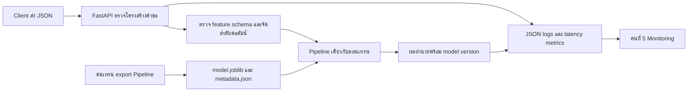

# ทำความเข้าใจโค้ดสำหรับตอบคำถาม

## การไหลของข้อมูล

## ไฟล์ที่ควรรู้

| ไฟล์ | อธิบายหน้าที่ |
|---|---|
| `app/main.py` | ประกาศ endpoint, โหลดโมเดลตอนเริ่มแอป, บันทึก logs/metrics และจัดการ response |
| `app/runtime.py` | อ่าน metadata/checksum, ตรวจฟีเจอร์, สร้าง DataFrame และเรียก Pipeline.predict |
| `scripts/export_model.py` | จุดส่งต่อโมเดลจากการเทรน รวม Pipeline กับ schema และตัวอย่าง input |
| `scripts/train_demo.py` | สร้างข้อมูลสังเคราะห์เพื่อทดสอบ serving เท่านั้น ใช้ seed และ split ตามเวลา |
| `scripts/load_test.py` | ส่งคำขอ HTTP พร้อมกันแบบจำกัดจำนวน แล้ววัด p50/p95/throughput/error rate |
| `scripts/verify_http.py` | เรียก endpoint จริงและบันทึกผล HTTP ปกติ/ผิดปกติเป็นหลักฐาน |
| `tests/test_serving.py` | ทดสอบว่า API ตรงกับ Pipeline, ข้อมูลเสียไม่เข้าสู่โมเดล, health/metrics ถูกต้อง |
| `Dockerfile` | กำหนด Python image พร้อม digest, dependencies, สร้างโมเดลสาธิต, user ที่ไม่ใช่ root และคำสั่งรัน |
| `compose.yaml` | เปิดพอร์ตและ restart policy; `compose.model.yaml` ใช้เลือกและ mount โมเดลจริงแบบอ่านอย่างเดียว |
| `slo.json` | เกณฑ์ความเร็ว/ปริมาณคำขอ/ข้อผิดพลาดที่ใช้เทียบผล benchmark |

## จุดสำคัญใน main.py

`create_app` สร้าง metrics registry แยกต่อแอปเพื่อไม่ให้ tests เกิด metric name ซ้ำ `lifespan` โหลดโมเดลก่อนรับคำขอและเก็บไว้ใน `app.state.runtime` จึงไม่ต้องโหลดไฟล์ทุกครั้ง หากโหลดไม่ผ่าน บันทึกสาเหตุใน logs และไม่อ้างว่าระบบพร้อม

`observe` ทำงานกับทุกคำขอ สร้างหรือรับ request ID ที่ผ่านรูปแบบที่กำหนด วัดเวลาตั้งแต่รับจนได้ response แล้วเก็บ labels ด้วยชื่อ route ที่จำกัด ไม่ใช้ URL แปลก ๆ ทั้งเส้นเป็น label จึงลดจำนวน time series ที่เกิดจากคำขอสุ่ม

`PredictionRequest` รับ envelope ที่มี `records` เท่านั้น ส่วน schema ของแต่ละ feature อยู่ใน metadata ซึ่งเปลี่ยนตามโมเดลได้ `predict` ตรวจข้อมูลก่อน แล้วเรียกโมเดล ถ้าข้อมูลผิดตอบ 422 ถ้าโมเดลไม่พร้อมตอบ 503 ถ้าโมเดลทำนายล้มเหลวตอบ 500 โดยไม่ส่งรายละเอียดภายในกลับผู้ใช้

`predict` เป็น `def` เพื่อให้ FastAPI รันใน thread pool แทนการบล็อก event loop ด้วยงานโมเดลซึ่งเป็น synchronous เดโมใช้ sklearn `n_jobs=1` และ uvicorn หนึ่ง worker เพื่อควบคุมงานซ้อนและให้ metrics ไม่แยก process

## จุดสำคัญใน runtime.py

`Manifest` กำหนดข้อมูลประจำโมเดล เช่นชื่อ เวอร์ชัน schema และ checksum `FeatureSpec` กำหนด type, nullable, minimum/maximum หรือ choices ของ category

`ModelRuntime` ตรวจ checksum และ sklearn เวอร์ชันก่อน `joblib.load` จากนั้นตรวจว่าโหลดเป็น Pipeline และชื่อฟีเจอร์ตรง metadata checksum ไม่แทนความเชื่อถือผู้สร้าง ต้องใช้ไฟล์โมเดลจากทีมเท่านั้น

`validate` ตรวจทุกแถวก่อนสร้าง DataFrame ไม่ยอมเปลี่ยน string เป็นตัวเลขเอง ไม่ยอมรับ bool แทน number และตรวจ NaN/Infinity เมื่อผ่านแล้วใช้ลำดับคอลัมน์จาก schema ตัวเลขแปลงเป็น float เพื่อแทน missing value ด้วย NaN ได้

`predict` ไม่ fit โมเดลและไม่คำนวณ preprocessing ใหม่ด้วยชุดคำขอ ใช้ imputer/scaler/encoder ที่อยู่ใน Pipeline เดิม ตรวจผลว่าได้หนึ่งตัวเลข finite ต่อแถว ใช้ lock เพื่อให้ inference ทีละคำขอ ลด CPU contention ของโมเดลตัวอย่าง โดยไม่มี prediction cache

สำหรับ schema ที่เป็นตัวเลขทั้งหมด สร้าง DataFrame พร้อม dtype ในครั้งเดียว เพื่อลดการสร้าง Series และการแปลงข้อมูลซ้ำหลายรอบต่อคำขอ การตรวจชนิดค่าก่อนสร้าง DataFrame ยังคงเดิม

## ตัวอย่าง preprocessing เดโม

ข้อมูลสังเคราะห์มี lag_1, lag_7, rolling_mean_7, day_of_week ซึ่งสร้างจากอดีตเท่านั้น โดยใช้ shift ก่อน rolling แบ่ง 5,000 แถวแรกฝึกและ 1,000 แถวท้ายทดสอบ ใช้ SimpleImputer ที่ fit จากชุดฝึกแล้วตามด้วย RandomForestRegressor การทดสอบตรวจว่าผล API ตรงกับ Pipeline โดยตรง

ตัวอย่างนี้ไม่ได้อ้างว่ามีการเทรน/เลือกโมเดลครบงานของคนที่ 2 หรือมี Registry ของคนที่ 3 มีไว้ทดสอบงานคนที่ 4 แบบทำงานจริง

## ประสิทธิภาพและข้อจำกัด

load test ใช้ worker จำนวนเท่ากับ concurrency อ่านคำขอจาก queue และส่ง HTTP ผ่าน connection pool เริ่มจับเวลารวมหลัง warmup เสร็จ คำขอผิดนับเป็น error ไม่ช่วยเพิ่ม successful throughput ตรวจทั้งสถานะและจำนวนผลทำนายก่อนนับว่าสำเร็จ

บริการไม่มีฐานข้อมูลเก็บประวัติ ไม่มี feature store ไม่มี drift detector และไม่มี authentication ในเดโม หากกลุ่มต้องใช้ระบบจริงนอกเครื่อง/เครือข่ายทีม ต้องออกแบบองค์ประกอบเหล่านี้ตามโจทย์ก่อนใช้งาน
